# Paginación por cursor en arquitectura hexagonal

Esta guía muestra cómo integrar `uker/pagination` sin acoplar el core de una
aplicación a HTTP, GORM ni al formato del cursor. Los ejemplos usan MySQL y
GORM, pero la separación de responsabilidades aplica a cualquier adaptador de
persistencia.

## Flujo completo

```mermaid
flowchart LR
    A["Cliente HTTP"] --> B["REST: ParseWithSecurity"]
    B --> C["Mapper REST → PageRequest"]
    C --> D["Puerto de entrada / use case"]
    D --> E["Puerto de salida / repositorio"]
    E --> F["Mapper PageRequest → pagination.Params"]
    F --> G["MySQL: Apply + ApplyFilters"]
    G --> H["Consulta LIMIT + 1 y COUNT"]
    H --> I["REST: BuildPageSigned"]
    I --> J["next_cursor / prev_cursor"]
```



El flujo recomendado es:

1. El adaptador REST decodifica `limit`, `sort`, filtros y `cursor` con
   `ParseWithSecurity`.
2. REST mapea esos datos a un `PageRequest` propio del core.
3. El use case pasa el request al puerto de salida sin interpretar SQL ni el
   cursor.
4. El adaptador MySQL convierte el contrato neutral a `pagination.Params`.
5. `pagination.Apply` agrega filtros, keyset, orden y `LIMIT limit + 1`.
6. `pagination.ApplyFilters` aplica los mismos filtros al `COUNT`.
7. REST conserva los resultados extra y llama a `BuildPageSigned` para
   construir la respuesta y los cursores.

## Responsabilidades por capa

| Capa             | Responsabilidad                                                        | No debería conocer              |
| ---------------- | ---------------------------------------------------------------------- | ------------------------------- |
| Core             | Límite, orden, filtros y posición de página como conceptos del negocio | HTTP, GORM, HMAC, Uker          |
| Adaptador REST   | Querystring, validación por endpoint, firma, TTL y respuesta HTTP      | SQL                             |
| Use case         | Orquestar la consulta y aplicar reglas de negocio                      | Base64, HMAC, GORM              |
| Puerto de salida | Expresar la búsqueda paginada en tipos del core                        | `*gorm.DB`, `pagination.Params` |
| Adaptador MySQL  | Mapear a Uker, generar SQL y contar                                    | Request/response HTTP           |

## 1. Contratos neutrales dentro del core

La integración más corta consiste en declarar un alias de Uker:

```go
type Params = pagination.Params
```

Esto compila y evita mappers, pero hace que el core dependa de Uker y expone en
los puertos detalles como `CursorPayload` y `RawCursor`. Para mantener la
arquitectura desacoplada, define tipos propios:

```go
package paging

type Direction string

const (
    Asc  Direction = "asc"
    Desc Direction = "desc"
)

type Sort struct {
    Field     string
    Direction Direction
}

type Filter struct {
    Fields   []string // más de uno representa OR
    Operator string
    Value    string
}

type BoundaryKind string

const (
    After  BoundaryKind = "after"
    Before BoundaryKind = "before"
)

type Boundary struct {
    Kind   BoundaryKind
    Values map[string]string
}

type PageRequest struct {
    Limit    int
    Sort     []Sort
    Filters  []Filter
    Boundary *Boundary
}

type Slice[T any] struct {
    Items []T // puede contener limit + 1 elementos
    Total int64
}
```

El puerto de entrada y el puerto de salida usan solamente estos tipos:

```go
type ProductUseCase interface {
    GetProducts(ctx context.Context, includeInactive bool, page paging.PageRequest) (paging.Slice[domain.Product], error)
}

type ProductRepository interface {
    GetProducts(ctx context.Context, page paging.PageRequest) (paging.Slice[domain.Product], error)
}
```

El use case decide qué consulta ejecutar, pero no interpreta el cursor:

```go
func (uc *productUseCase) GetProducts(
    ctx context.Context,
    includeInactive bool,
    page paging.PageRequest,
) (paging.Slice[domain.Product], error) {
    if includeInactive {
        return uc.repo.GetAllProducts(ctx, page)
    }
    return uc.repo.GetProducts(ctx, page)
}
```

## 2. Adaptador REST

### Parsear la primera página o un cursor

Centraliza el secreto y el TTL en una configuración compartida:

```go
type paginationConfig struct {
    cursorSecret []byte
    cursorTTL    time.Duration
}

func (c paginationConfig) parse(r *http.Request) (pagination.Params, error) {
    return pagination.ParseWithSecurity(
        r.URL.Query(),
        c.cursorSecret,
        c.cursorTTL,
    )
}
```

`ParseWithSecurity` interpreta:

- `limit`: 25 por defecto y 100 como máximo.
- `sort`: por ejemplo `created_at:desc,id:desc`.
- Filtros: `status_eq=active`, `price_gte=100`.
- Grupos OR: `name,description_like=asado`.
- `cursor`: un cursor firmado generado por una página anterior.

Cuando existe `cursor`, el cliente no debe volver a enviar `limit`, `sort` ni
filtros. Esos valores ya viajan dentro del cursor. Los parámetros que no tienen
un operador de filtro reconocido se ignoran desde `v1.0.0`.

Si hay campos que el cliente nunca debe controlar, usa:

```go
params, err := pagination.ParseWithSecurityBlockedFilters(
    r.URL.Query(),
    cursorSecret,
    cursorTTL,
    []string{"user_id", "tenant_id"},
)
```

El scope real se agrega a la consulta base con valores obtenidos de la sesión,
no desde `params.Filters`.

### Mapear hacia el core

El mapper REST traduce `pagination.Params` a `paging.PageRequest`. Debe copiar:

- `Limit`.
- Cada expresión de `Sort`.
- Los filtros, separando el operador por el último `_` y los campos por `,`.
- `Cursor.After` o `Cursor.Before` como un `Boundary` neutral.

Conserva también el `pagination.Params` original dentro del handler: se usará
al construir la respuesta, pero no se pasa al core.

### Construir la respuesta

```go
transportParams, err := h.pagination.parse(r)
if err != nil {
    // responder 400; distinguir ErrCursorExpired si el contrato lo requiere
}

pageRequest, err := toCorePageRequest(transportParams)
if err != nil {
    // responder 400
}

result, err := h.uc.GetProducts(r.Context(), includeInactive, pageRequest)
if err != nil {
    // mapear el error del core
}

page, err := pagination.BuildPageSigned(
    transportParams,
    result.Items,
    transportParams.Limit,
    result.Total,
    nil,
    h.pagination.cursorSecret,
)
if err != nil {
    // responder 500: no se pudo construir un cursor
}

httpx.FinalOutput(w, http.StatusOK, page)
```

`BuildPageSigned` elimina el registro `limit + 1`, calcula `has_more` y genera
`next_cursor` y `prev_cursor`. Con extractor `nil`, Uker usa reflection y busca
cada campo de orden por:

- Nombre Go y su variante `snake_case`.
- Tags `json`, `db` y `gorm:"column:..."`.
- Campos exportados embebidos.

Si el DTO no conserva los nombres usados en `sort`, pasa un extractor explícito:

```go
extract := func(item ProductResponse) (map[string]string, error) {
    return map[string]string{
        "created_at": item.CreatedAt.UTC().Format(time.RFC3339),
        "id":         item.ProductID,
    }, nil
}
```

El extractor debe devolver todos los campos presentes en `params.Sort` usando
exactamente las mismas claves, incluidos los prefijos de tabla si los hubiera.

## 3. Adaptador MySQL con GORM

El mapper de persistencia reconstruye `pagination.Params` a partir del contrato
neutral. `RawCursor` no es necesario en el repositorio; pertenece al adaptador
REST.

```go
func toUkerParams(page paging.PageRequest) pagination.Params {
    params := pagination.Params{
        Limit:   page.Limit,
        Sort:    toUkerSort(page.Sort),
        Filters: toUkerFilters(page.Filters),
    }

    if page.Boundary != nil {
        params.Cursor = &pagination.CursorPayload{}
        switch page.Boundary.Kind {
        case paging.After:
            params.Cursor.After = page.Boundary.Values
        case paging.Before:
            params.Cursor.Before = page.Boundary.Values
        }
    }

    return params
}
```

El repositorio debe partir de dos queries equivalentes: una para datos y otra
para el total. Repetir el scope base evita que el cursor o el `LIMIT` afecten el
`COUNT`:

```go
func (r *productRepository) GetProducts(
    ctx context.Context,
    page paging.PageRequest,
) (paging.Slice[domain.Product], error) {
    params := toUkerParams(page)

    dataBase := r.db.WithContext(ctx).
        Model(&domain.Product{}).
        Where("listed = ?", true)

    dataQuery, err := pagination.Apply(dataBase, params)
    if err != nil {
        return paging.Slice[domain.Product]{}, err
    }

    var products []domain.Product
    if err := dataQuery.Find(&products).Error; err != nil {
        return paging.Slice[domain.Product]{}, err
    }

    countBase := r.db.WithContext(ctx).
        Model(&domain.Product{}).
        Where("listed = ?", true)

    countQuery, err := pagination.ApplyFilters(countBase, params.Filters)
    if err != nil {
        return paging.Slice[domain.Product]{}, err
    }

    var total int64
    if err := countQuery.Count(&total).Error; err != nil {
        return paging.Slice[domain.Product]{}, err
    }

    return paging.Slice[domain.Product]{Items: products, Total: total}, nil
}
```

`pagination.Apply` agrega:

- Filtros.
- Condiciones keyset `after` o `before`.
- `ORDER BY`.
- `LIMIT params.Limit + 1`.

No usa `OFFSET`. Para `created_at DESC, id DESC`, una página siguiente aplica
conceptualmente:

```sql
WHERE (created_at, id) < (?, ?)
ORDER BY created_at DESC, id DESC
LIMIT 26;
```

Para navegar hacia atrás, Uker invierte temporalmente el orden SQL y
`BuildPageSigned` vuelve a invertir el slice antes de responder.

## 4. Contrato HTTP

La respuesta tiene esta forma:

```json
{
	"data": [],
	"paging": {
		"limit": 25,
		"total": 120,
		"has_more": true,
		"next_cursor": "b64!...",
		"prev_cursor": "b64!..."
	}
}
```

El cliente debe tratar el cursor como opaco y enviarlo usando el encoder de
querystrings de su plataforma:

```http
GET /products?cursor=b64%21...
```

Aunque el helper interno se llama `base64url`, el formato actual de Uker usa el
prefijo `b64!` y Base64 estándar. No debe concatenarse manualmente sin
URL-encoding.

El JSON interno contiene conceptualmente:

```json
{
	"v": 1,
	"limit": 25,
	"sort": [
		["created_at", "desc"],
		["id", "desc"]
	],
	"filters": { "status_eq": "active" },
	"after": { "created_at": "2026-08-01T10:00:00Z", "id": "abc" },
	"ts": 1785592800,
	"sig": "..."
}
```

Los cursores nuevos firman con HMAC-SHA256 `v`, `limit`, `sort`, `filters`,
`after`, `before` y `ts`. Modificar cualquiera de esos valores invalida el
cursor. La firma no cifra el contenido: no incluyas secretos ni datos
personales en filtros o límites keyset.

El TTL se aplica solo cuando es mayor que cero. Un TTL igual a cero significa
que el cursor no expira. Usa un secreto largo, aleatorio, estable entre réplicas
y distinto por ambiente.

## 5. Orden estable, filtros y total

### El desempate único es obligatorio

Desde `v1.2.1`, Uker no agrega `id` automáticamente cuando el cliente envía un
orden. Por eso:

```text
sort=created_at:desc
```

no es suficiente si varios registros comparten `created_at`. Define siempre un
orden total:

```text
sort=created_at:desc,id:desc
```

El campo de desempate puede ser otra clave única. La dirección no tiene que ser
la misma para todos los campos, aunque los índices deben acompañar el patrón de
consulta.

### El COUNT debe usar los mismos filtros

`pagination.Apply` aplica filtros a los datos, pero Uker no calcula el total.
El `COUNT` debe reutilizar el mismo scope base y llamar explícitamente a
`ApplyFilters`. Nunca le apliques el cursor ni el límite.

### Allowlists por endpoint

Valida por separado los campos ordenables y filtrables antes de mapear al core.
`pagination.AllowedColumns` es una variable global; no la cambies por request,
porque distintos handlers podrían interferirse entre sí. Puede fijarse una vez
al iniciar el proceso si toda la aplicación comparte la misma lista. Para
políticas diferentes por endpoint, usa validadores propios en el adaptador.
